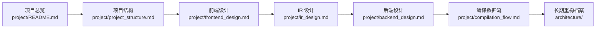

# SysY Compiler Docs

这个目录分成两类文档：

- `project/`: 面向项目掌握和面试讲解，重点描述项目组织、模块划分、依赖关系和数据流。文档尽量使用 Mermaid 图配合文字说明。
- `architecture/`: 面向长期重构和演进规划，记录当前架构基线、支持边界表、任务拆分和重构路线。

建议阅读顺序：

如果目标是准备面试，优先阅读 `project/`。如果目标是继续推进代码重构，优先阅读 `architecture/`。
