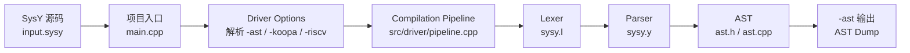
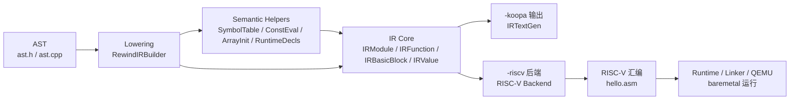

# Compiler Module Flow

这份文档用两张较小的模块图描述当前 SysY 编译器的数据流。第一张图到 AST 为止，第二张图从 AST lowering 到 IR、RISC-V 和 baremetal 运行。

## 输入到 AST

## AST 到 IR 和目标输出

拆分边界放在 AST：前半部分强调前端和 driver 如何生成 AST，后半部分强调 AST 如何通过 lowering 进入 Rewind IR，并由 IR printer 或 RISC-V backend 消费。
