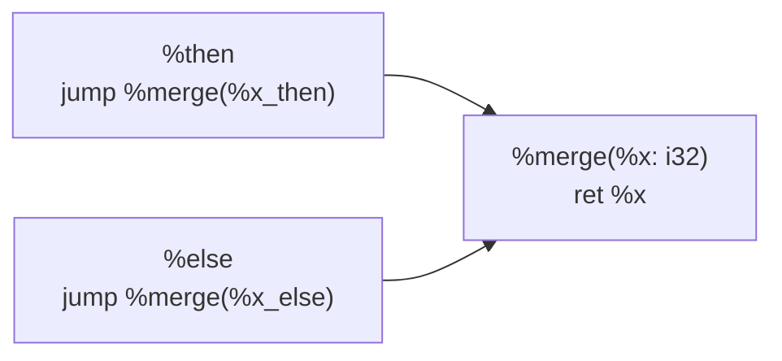

# A11 SSA And Mem2Reg Design

这份文档专门规划 A11。A11 的目标不是把 AST lowering 立即改写成 SSA 生成器，而是在当前
`lower -> IR -> Pass -> Backend` 链路上补齐 SSA 基础设施，并先通过 `mem2reg` 把可提升的
局部标量从 `alloc/load/store` 形式转换成 SSA value。

## 任务边界

A11 解决三件事：

1. 让 Rewind IR 能表达控制流合流后的 SSA value。
2. 建立 `mem2reg` 依赖的 CFG、支配关系和 IR 改写能力。
3. 在不破坏当前 `-koopa`、`-riscv` 链路的前提下，先提升最简单的局部标量。

A11 不负责：

- 把所有 AST lowering 改成直接生成 SSA。
- 提升数组、数组形参、指针地址计算和逃逸地址。
- 引入通用优化框架之外的大量优化 pass。
- 借 A11 完成 Machine IR、RISC-V asm、寄存器分配或 QEMU 运行闭环。这些后端任务统一归入
  A13。

## 表示方案

### 采用 Basic Block Arguments

Rewind IR 选择 **Basic Block Arguments** 表达 SSA 合流，而不是先增加单独的 `Phi`
指令。这个表示与传统 Phi 语义等价：

```text
; Phi 视角
%merge:
  %x = phi [%x_then, %then], [%x_else, %else]
  ret %x
```

```text
; Basic block arguments 视角
%then:
  jump %merge(%x_then)

%else:
  jump %merge(%x_else)

%merge(%x: i32):
  ret %x
```

合流块定义参数，前驱控制流边传递参数。这样 `%merge` 中的 `%x` 本身就是 SSA value，
而 incoming value 和 CFG edge 保持在一起。

Koopa raw IR 已经提供了这套视角：basic block 持有参数，`jump` 持有目标参数，
`branch` 的 true/false 两条边分别持有参数。当前 `tmp/koopa.h` 可以作为 Rewind IR
在 C++ 结构上的直接参考。

这条路线也符合现代 IR 的已有实践。MLIR 的
[Rationale](https://mlir.llvm.org/docs/Rationale/Rationale/#block-arguments-vs-phi-nodes)
明确说明 block arguments 与 Phi 在表达能力上等价，并列出它减少 Phi 特殊情况、
统一 entry block 参数和显式暴露边上传值语义等优点；MLIR
[LangRef](https://mlir.llvm.org/docs/LangRef/#blocks) 也把非 entry block 参数的值来源
定义为 terminator successor operands。MLIR 文档同时指出 Swift SIL 之前已经采用过类似设计。

### 预期 IR 形状



采用这个表示后，A11 的核心变化不是“给块首插 Phi 指令”，而是：

- 给合流 block 添加 block arguments。
- 给 `jump` / `branch` 的 successor edge 添加 edge arguments。
- 让 verifier、printer 和 pass 都认识这套参数流；后端承接放到 A13。

## 当前基础设施缺口

当前 Rewind IR 已有 `IRValueKind::BLOCK_ARG_REF` 占位，但结构还不足以承载
block-argument SSA。

| 缺口 | 当前状态 | A11 需要补齐的能力 |
| --- | --- | --- |
| Block argument value | 只有 `BLOCK_ARG_REF` kind，没有具体 value 类型 | 增加可被 operand 使用的 `IRBlockArgRef` |
| Basic block signature | `IRBasicBlock` 只有名称和指令 | 增加 block parameter 列表 |
| Edge arguments | `IRJumpInst` / `IRBranchInst` 只记录目标 block | 为 jump 和 branch 的 successor edge 增加参数 |
| IR text | 只打印 `%bb:`、`jump %bb`、`br cond, %a, %b` | 打印 block params 与 edge args |
| Verifier | 只检查 target 属于当前 function | 检查 edge arg 数量、类型、目标 block 参数和入口块约束 |
| CFG analysis | 没有稳定 predecessor/successor 访问层 | 从 terminator 建立 CFG 视图 |
| Dominance analysis | 尚未实现 | 提供 dominator tree 与 dominance frontier |
| Pass mutation | 当前 pass 主要可遍历 IR | 支持遍历/替换 operand、删除可消去的 alloc/load/store |
| Backend lowering | 分支和跳转只输出 label | 不属于 A11，后续在 A13 的 Machine IR / RISC-V 链路中承接 |

## A11 准备项

### 1. 固定 SSA 合流契约

需要先把以下契约写进 IR 结构、printer 和 verifier：

- `IRBlockArgRef` 是 value，不是 basic block instruction。
- block parameter 的定义点是所属 block 的入口。
- 每条进入目标 block 的 edge arguments 必须与目标 block parameters 数量一致。
- 每个 edge argument 的类型必须与对应 block parameter 类型一致。
- entry block 参数策略要明确。A11 第一阶段建议继续把函数参数保留为现有
  `IRFuncArgRef`，不顺手合并函数参数和 entry block 参数模型。

最后一条是刻意收窄范围：MLIR 可以把函数入口参数和 entry block 参数统一，但当前 Rewind IR
已经有稳定的 `IRFunction::params_` 与 `IRFuncArgRef`，A11 不需要为追求形式统一扩大改动面。

### 2. 建立 CFG 视图

`mem2reg` 需要关心真实 CFG，而不是 basic block 在 vector 中的排列顺序。A11 需要提供：

- function entry block。
- 每个 block 的 successor。
- 每个 block 的 predecessor。
- 可复用的 block 遍历顺序。

第一阶段建议从 terminator 计算 CFG 视图，而不是立即把 `preds_` / `succs_` 作为可变缓存塞回
`IRBasicBlock`。这样 CFG 信息来源单一，先避免 IR 改写后缓存失效。

### 3. 建立支配关系

标量 `mem2reg` 需要：

- `dominate(a, b)` 查询。
- immediate dominator。
- dominator tree 子节点遍历。
- dominance frontier。

如果采用 block arguments，那么 dominance frontier 仍然存在，只是“插 Phi”变成
“在 frontier block 增加 block parameter，并给前驱边补 edge argument”。

### 4. 建立 IR 改写接口

`mem2reg` 不只是添加 block params，还需要删除旧内存形式。A11 需要控制改写入口，避免每个
pass 手写一套指令字段替换逻辑：

- 遍历 instruction operands。
- 替换 operand use。
- 从 block instruction 序列中移除被提升的 `alloc/load/store`。
- 允许 `IRModule` 继续持有已经不再挂在 block 上的 value，先不引入复杂 value 回收。

如果这层缺失，后续 A12 的常量传播、DCE 等 pass 会重复碰到同一类问题。

## 分阶段方案

### A11.1 IR 支持 Block Arguments

目标：让 IR 本身能合法表达 SSA 合流，但先不要求普通 SysY lowering 生成它。

状态：第一阶段已完成。当前 IR core、text printer 和 verifier 已能承接 block params 与
branch/jump edge args；block argument 通过 `IRModule::make_block_param` 创建并记录所属
basic block；AST lowering 侧的 `FuncContext` 仍默认构造空 edge args。

工作内容：

- 增加带 owner block 的 `IRBlockArgRef`。
- 在 `IRBasicBlock` 中加入 parameters。
- 在 `IRJumpInst` 和 `IRBranchInst` 中加入 successor edge arguments。
- 给 `IRModule` 增加 `make_block_param` 作为创建 block argument 的统一入口。
- 扩展 IR text printer。
- 扩展 verifier。
- 增加手工构造 block-argument IR 的 verifier/printer smoke。

验收：

- 通过手工构造的 printer/verifier smoke，能打印并验证以下形状的 IR：

```text
%then:
  jump %merge(1)

%else:
  jump %merge(2)

%merge(%x: i32):
  ret %x
```

- 现有 lowering 不生成 block params 时，当前回归链路不变。
- A11.1 不要求把 SysY 局部变量的 `alloc/load/store` 自动改写成这类 SSA IR；
  该转换由后续 CFG、dominance、IR rewrite 和 `mem2reg` 阶段完成。

### A11.2 建立 CFGAnalysis

目标：把“basic block 之间如何流动”变成独立分析结果。

状态：第一阶段已完成。当前新增 `CFGAnalysis`，从 terminator 计算 successors，
反向建立 predecessors，并暴露 entry、function block 顺序、reachable blocks 和 edge 查询。

工作内容：

- 从每个 block terminator 计算 successors。
- 反向建立 predecessors。
- 暴露 entry block 和 function 内 block 校验入口。
- 为 `if/else` 和 `while` 形状准备 CFG smoke；短路逻辑可以在后续 dominance/mem2reg
  smoke 中继续补充。

验收：

- CFG 结果不依赖打印顺序猜测。
- verifier 和后续 dominance 分析可以复用 CFG。

### A11.3 建立 DominanceAnalysis

目标：为 block parameter placement 准备支配关系。

状态：第一阶段已完成。当前新增 `DominanceAnalysis`，基于 `CFGAnalysis` 的 reachable blocks
计算 dominator sets、immediate dominator、dominator tree children 和 dominance frontier。
第一版只在 reachable blocks 上建立支配关系；不可达 block 的 `immediate_dominator` 为
`nullptr`，不会参与 `mem2reg`。

工作内容：

- 计算 reachable blocks。
- 计算 immediate dominator 与 dominator tree。
- 计算 dominance frontier。
- 对不可达 block 的策略写清楚。第一版可以只在 reachable blocks 上执行
  `mem2reg`，并让 verifier 继续保证结构合法。

验收：

- `if/else` 的 merge block 落在两个分支定义的 frontier 中。
- `while` header 能覆盖循环回边带来的合流位置。

说明：当前确实保留 dominator tree。它不只是为了查询 `dominates(a, b)`，后续 `mem2reg`
重命名阶段需要沿支配树从入口向下遍历，维护每个变量当前可见的 SSA value。

### A11.4 提供 IR Rewrite 基础接口

目标：让 pass 能稳定改写现有 IR。

状态：第一阶段已完成。当前新增 `ir_rewrite` 工具层，提供 operand 统一遍历、
单条 value operand 替换、function/module 级 use 替换，以及 basic block 内 instruction
摘除接口。死 value 暂时仍由 `IRModule` 继续持有，pass 只负责把它从 block 指令序列中移除，
不在改写过程中做内存回收。

工作内容：

- 抽出 operand 遍历与替换入口。
- 提供 block instruction erase helper。
- 明确死 value 的 ownership 策略。
- 用最小测试验证替换 load use、删除旧 instruction 后 printer/verifier 仍正常。

验收：

- `mem2reg` 不需要在每个调用点手工修改所有 instruction field。
- 这层能力能被 A12 pass 复用。

验证：

- `make ir-rewrite-smoke` 覆盖 `load` use 替换、旧 `load` 指令摘除、IR printer/verifier
  闭环，以及 branch/jump edge arguments 通过统一 operand 入口被改写。

### A11.5 实现标量 Mem2Reg

目标：把局部、非逃逸、标量 `alloc i32` 从内存形式提升成 SSA value。

状态：第一阶段已完成。当前新增 `Mem2RegPass`，以可选 `IRModulePass` 形式接入
`IRPassManager`；它不会默认进入 `-koopa` / `-riscv` 主链路，因此这两个模式输出仍保持
memory-form IR。为了测试真实前端链路，driver 额外提供 `-ssa` compile mode：输入仍然是
SysY 源码，流程是 `parse -> AST -> memory-form IR -> Mem2RegPass -> SSA IR text`。第一版只提升
可证明安全的局部 `alloc i32`，并通过 pass smoke 与真实 SysY smoke 验证 single block、
`if/else` 合流和 `while` 回边三类形状。

第一版 promotion 条件：

- 只处理局部 `alloc i32`。
- 使用点只允许是直接 `load` 和直接 `store`。
- 不处理数组 alloc。
- 不处理被 `getptr` / `getelemptr` 派生地址引用的 alloc。
- 不处理作为 call argument 或 return value 传出的地址。
- 不提升可能读取未初始化值的 alloc；第一版宁可保守跳过，也不制造错误 SSA value。

核心过程：

1. 收集可提升 alloc。
2. 收集每个 alloc 的定义 block。
3. 根据 dominance frontier 给必要 block 添加参数。
4. 沿 dominator tree 重命名，维护“当前变量值”。
5. 用当前 SSA value 替换 load result。
6. 删除已提升变量的 alloc/load/store。
7. 在 predecessor edge 上补 block argument 的 incoming value。

验收：

- 简单赋值、if/else、while 三类标量局部变量能从 `alloc/load/store` 变成 SSA value。
- 数组和地址语义保持原路径，不被误提升。
- mem2reg 前后程序语义一致。

验证：

- `make mem2reg-smoke` 通过 `IRPassManager` 运行 `Mem2RegPass`，覆盖：
  single block 中 `ret load` 变成 `ret scalar`；
  `if/else` 两侧 store 后在 merge block 生成 block argument；
  `while` 回边将更新后的 value 作为 header block argument 的 incoming value。
- `make mem2reg-smoke` 会额外输出可人工查看的 IR 文本到 `tmp/mem2reg-smoke/*.koopa`。
  其中 `if_else.koopa` 用来直接验证以下形状：

```text
%then:
  jump %merge(%x_then)

%else:
  jump %merge(%x_else)

%merge(%x: i32):
  ret %x
```

- 复杂场景当前覆盖两个变量同时在同一个 merge block 合流、`while` header 的 entry/backedge
  两路 incoming value，以及未初始化读取和 `getptr` 派生地址这类不应被提升的情况。
- `make ssa-smoke` 使用真实 SysY 源文件验证 `-ssa` 模式，覆盖 `if/else` 和 `while`：
  输出会落到 `tmp/ssa-smoke/*.ssa.koopa`，并检查生成结果中已经没有被提升变量的
  `alloc i32` / `load` / `store`。

限制：

- 当前 pass 仍是可选 pass，只在 `-ssa` 测试/验证模式中启用，不影响默认 `-koopa` / `-riscv`。
- 当前 RISC-V backend 尚未 lowering block arguments，因此默认 `-riscv` 不运行 mem2reg。

## 后端承接边界

A11 只负责让 Rewind IR 能表达并生成 SSA block arguments。启用 `mem2reg` 后，block
arguments 仍然停留在 IR text / pass 验证层，不要求当前 `-riscv` 默认后端理解它们。

SSA IR 到 Machine IR、edge-copy / parallel-copy、栈帧、序言收尾、MachineAsmPrinter 和
RISC-V asm 输出统一归入 A13，并在 `docs/architecture/riscv_backend_design.md` 中维护。

## 建议推进顺序

建议按下面顺序落地：

1. A11.1 先把 block-argument IR 结构、printer、verifier 闭环打通。
2. A11.2 和 A11.3 建立 CFG 与 dominance 分析。
3. A11.4 补 IR rewrite 接口，再开始写会删除/替换 value 的 pass。
4. A11.5 在 `IRPassManager` 中接入可控的标量 `Mem2RegPass`。

当前 `-ssa` 已经提供真实 SysY 输入到 SSA IR text 的验证入口；在 A13 后端 Machine IR 链路
没有承接 block arguments 前，不要让 `Mem2RegPass` 默认作用于 `-riscv`。

## 验证计划

A11 每阶段都要保留已有最小链路：

- `cmake --build build -j4`
- `make ir-verifier-smoke`
- `make ssa-smoke`
- `make regression-smoke`

进入 A11.5 后，至少补以下回归形状：

- 单 block 标量变量：不需要 block argument。
- `if/else` 两侧 store，merge 后 load。
- `while` header 中读取、body 中更新、回边回到 header。
- 嵌套 if/while。
- 数组初始化、数组访问和数组形参，确认不被 promotion 误伤。

Docker autotest 仍作为阶段性回归，不要求每个微小提交都跑完整套件；当 mem2reg 默认进入
driver 路径后，应至少重新跑当前主要 `lv9` 的 `-koopa` 和 `-riscv` 检查。

## 风险与约束

- **未初始化局部变量**：当前 lowering 对其语义策略需要先沿用现有行为，mem2reg 不能隐式制造
  一个与当前 IR 不一致的默认值。
- **循环回边**：while header 的 incoming value 同时来自 entry edge 和 backedge，是第一版
  block argument placement 的关键用例。
- **边参数拷贝**：backend 在分支边上不能把 true/false 两套 incoming value 混在一起。
- **范围膨胀**：A11 的价值是让 Rewind IR 具备 SSA 与 pass 的基础，不应在这一步同时追求
  大规模优化收益。

## 完成定义

A11 完成时应满足：

1. Rewind IR 有稳定的 block-argument SSA 合流表示。
2. CFG、dominance 与 IR rewrite 基础设施可复用。
3. `Mem2RegPass` 能提升第一版 promotable scalar alloc。
4. verifier 能检查 block params 与 edge args 的关键结构/类型契约。
5. 后端承接方案已经在 A13 文档中明确，不混入 A11 实现范围。
