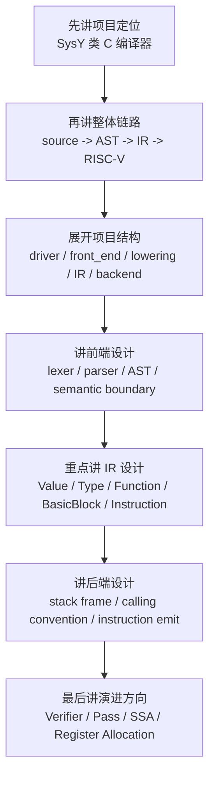

# Project Guide

这个目录用于维护 SysY 编译器的项目组织、模块划分、模块依赖和数据流。它更偏向“讲清楚项目”，适合面试前复盘，也适合后续快速回忆代码结构。

## 文档索引

- `project_structure.md`: 合并说明仓库目录、源码组织、逻辑模块和依赖方向。
- `frontend_design.md`: 从词法分析、语法分析、语义边界和 AST 设计说明前端。
- `ir_design.md`: 说明 Rewind IR 在项目中的位置、对象关系和 lowering 上下文。
- `backend_design.md`: 说明 RISC-V 后端、栈帧、调用约定和指令翻译。
- `compilation_flow.md`: 从一份 SysY 源码出发，说明如何生成 AST、IR、RISC-V 汇编和 baremetal 产物。
- `个人记录/`: 个人复盘记录，按 `前端.md`、`中间表示.md`、`后端.md` 维护更细的面试讲述和自我理解。

## 面试讲解路径

一句话总结：

> 这个项目以自定义 Rewind IR 为核心，把 SysY 前端语义和 RISC-V 后端代码生成解耦，并为后续 SSA、优化 Pass 和寄存器分配预留演进空间。
