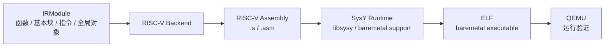
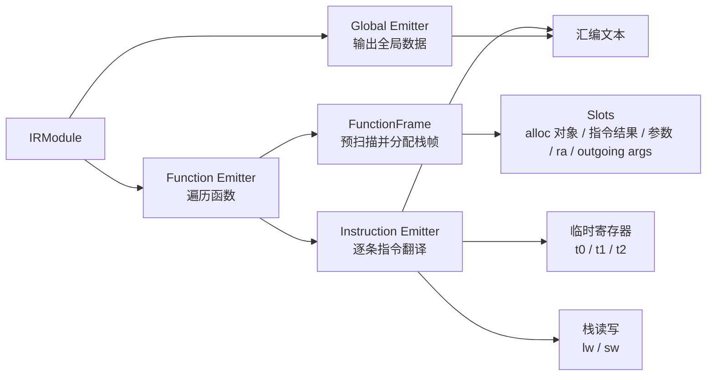
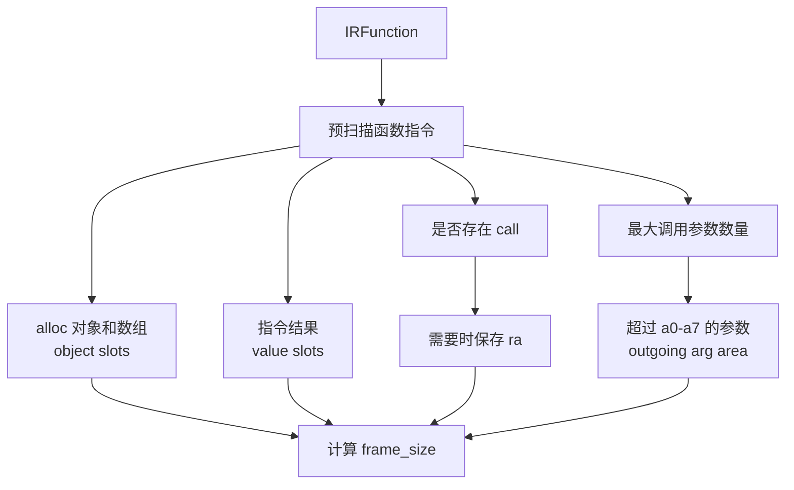
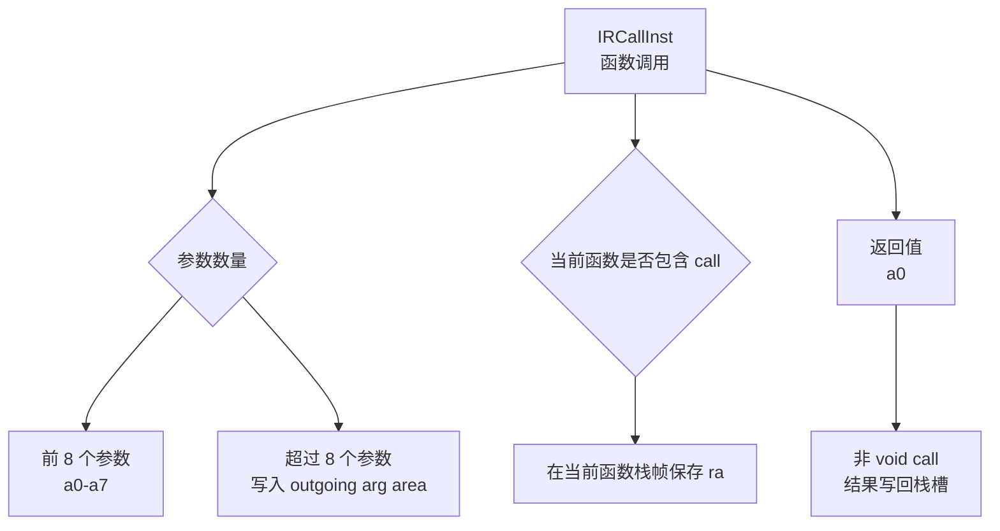
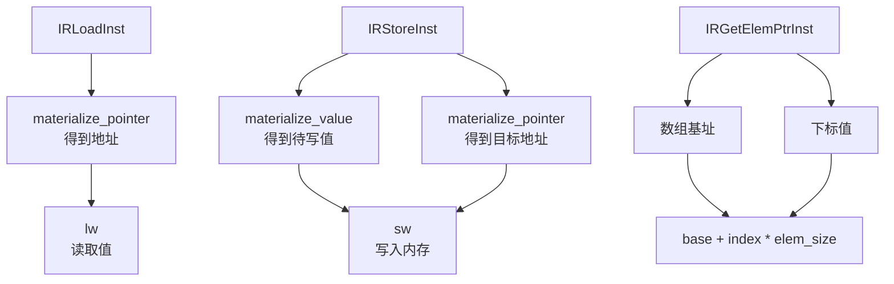

# Backend Design

这份文档说明 RISC-V 后端如何消费 Rewind IR 并生成汇编。

## 后端输入输出

后端只消费 IR，不直接读取 AST 或 parser 信息。这样可以保证目标代码生成和前端语法细节解耦。

## 后端生成流程

当前后端策略优先保证正确性，采用栈式模型：

- 局部变量和数组通过栈帧对象槽保存。
- 有结果的 IR 指令可以分配 value slot。
- 指令执行时把操作数物化到临时寄存器，再把结果写回栈槽。
- 大 offset 超出 RISC-V imm12 范围时，使用临时寄存器辅助地址计算。

## 栈帧和调用约定

函数调用约定：

## 指令翻译示例

面试时可以这样总结：

> 当前后端是稳定优先的栈式 RISC-V 后端。它先预扫描 IRFunction 计算栈帧，再逐条翻译 IR 指令。函数调用遵守 a0-a7 参数寄存器和栈上传参规则，必要时保存 ra。这个设计虽然还不是高性能寄存器分配，但正确性强，也方便后续引入虚拟寄存器、活跃区间和 linear scan。
