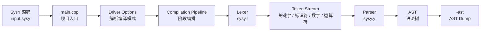
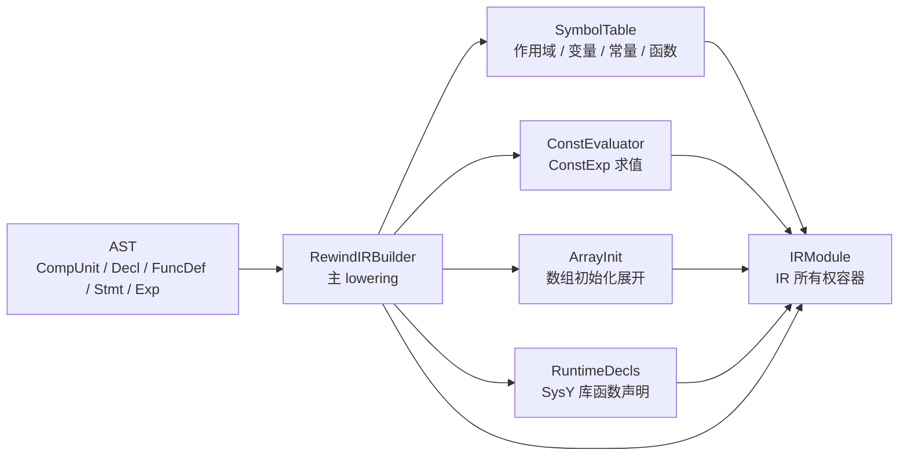
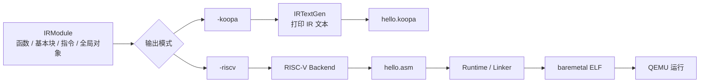
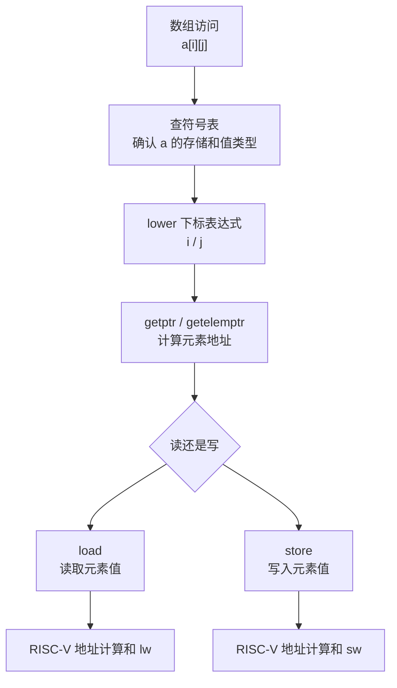

# Compilation Data Flow

这份文档从一份 SysY 输入出发，说明数据如何在项目中流动。

## 前端数据流

## AST 到 IR

## IR 到输出

## 典型语义数据流

面试时可以这样总结：

> 数据流上，源码先进入 front end 生成 AST；AST 经过 lowering 进入 Rewind IR；后续 `-koopa` 和 `-riscv` 都只消费 IR。数组、函数调用、控制流等复杂语义都在 AST 到 IR 的阶段被显式化，后端只需要按 IR 指令完成目标相关翻译。
