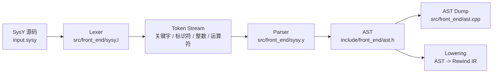
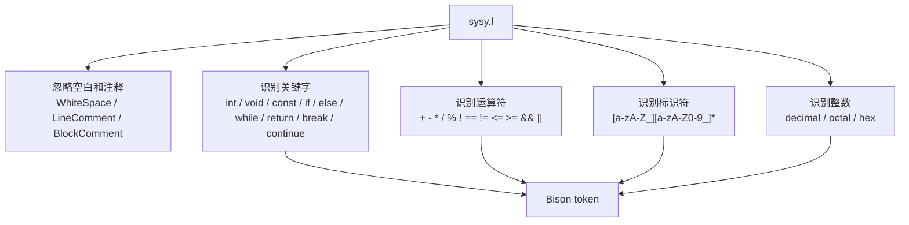
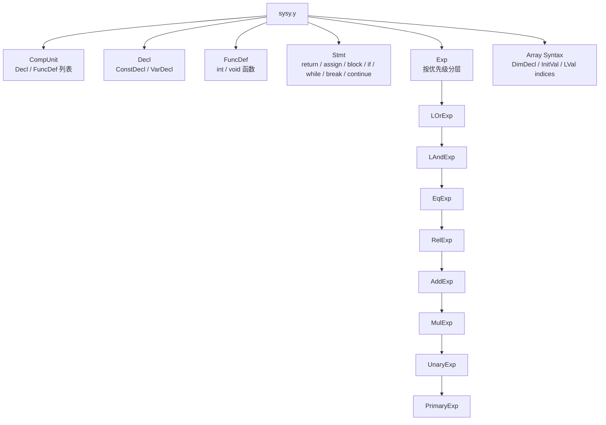
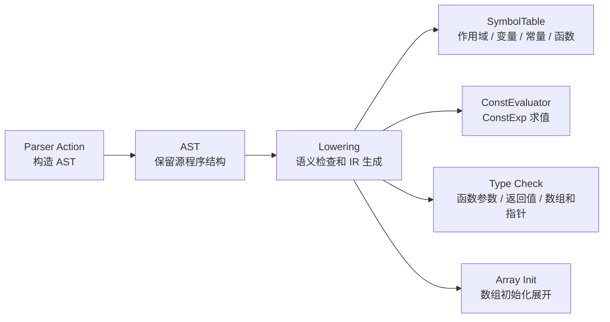
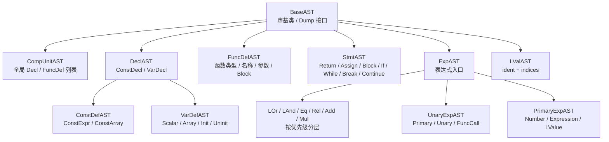

# Frontend Design

这份文档从词法分析、语法分析、语义边界和 AST 设计四个角度说明前端。

## 前端主流程

## 词法分析

词法层只做 token 切分，不判断变量是否定义、类型是否匹配，也不处理数组维度是否合法。这些语义信息交给后续 parser action 和 lowering 阶段处理。

## 语法分析

语法层有几个设计点：

- `CompUnit` 允许全局声明和函数定义混合出现。
- `FuncDef` 中把 `int` 和 `void` 函数分开写，避免和变量声明开头产生冲突。
- 表达式按优先级拆成 `LOrExp -> LAndExp -> EqExp -> RelExp -> AddExp -> MulExp -> UnaryExp -> PrimaryExp`。
- `MatchedStmt` 和 `UnMatchedStmt` 用来处理 dangling else。
- 多维数组通过 `DimDeclList`、`InitValList`、`ConstInitValList` 和 `LVal` 的 index 列表表达。

## 语义分析边界

当前项目里，前端 parser 主要负责构造 AST，真正的语义检查大多发生在 AST 到 IR 的 lowering 阶段。例如：

- 标识符是否定义，由符号表查询处理。
- `ConstExp` 是否能编译期求值，由 `ConstEvaluator` 处理。
- 函数调用实参与形参是否匹配，在 lowering call 时检查。
- 数组维度、数组初始化、数组形参 decay，在 lowering 阶段显式转成 IR 类型和寻址指令。

这个边界的好处是 parser 不需要理解 IR，也不需要直接处理目标相关细节。

## AST 设计

AST 节点整体采用：

- `BaseAST` 作为统一基类。
- `std::unique_ptr<BaseAST>` 表达树形所有权。
- `std::vector<std::unique_ptr<BaseAST>>` 表达列表结构。
- `std::variant` 表达同一语法节点的不同形态，比如 `StmtAST::Return`、`StmtAST::Assign`、`StmtAST::SelectStmt`。

面试时可以这样总结：

> 前端只负责把源代码稳定地表达成 AST。词法层切 token，语法层按 SysY 文法构造 AST，AST 用 `unique_ptr` 表达所有权、用 `variant` 表达节点变体。符号、类型、数组初始化和函数调用检查不塞进 parser，而是在 lowering 阶段统一处理。
