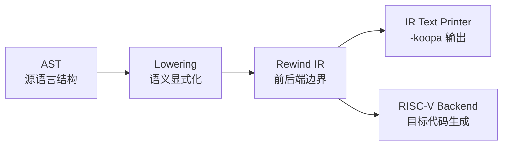
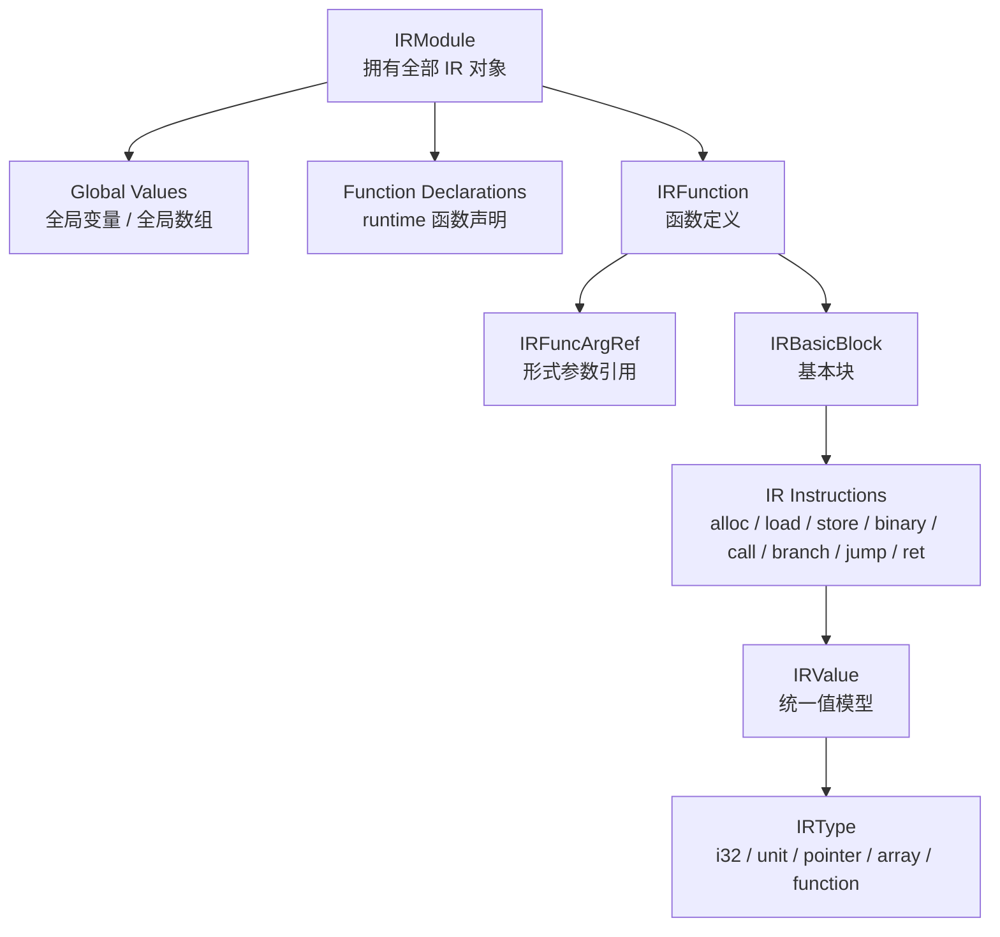
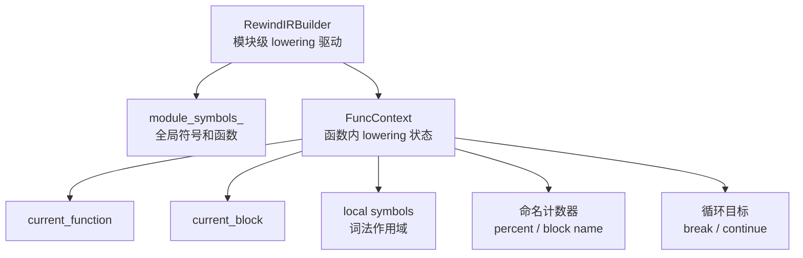
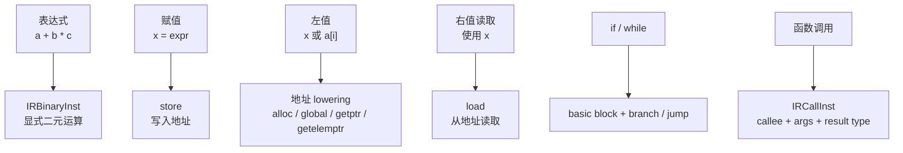

# IR Design

这份文档聚焦 Rewind IR 的结构和 AST 到 IR 的 lowering 关系。

## IR 在项目中的位置

Rewind IR 的作用不是复制 SysY 语法，而是把前端语义转换成更接近编译器中间层的表示，例如显式的函数、基本块、load/store、branch/jump、call、数组寻址和全局对象。

## IR 对象关系

核心设计点：

- `IRModule` 负责 IR 对象所有权和 factory。
- `IRValue` 是统一值模型，常量、参数引用和指令都可以作为 value。
- `IRInstruction` 继承自 `IRValue`，有结果的指令可以被后续指令引用。
- `IRType` 表达 `i32`、`unit`、pointer、array、function 等类型。
- `IRFunction` 包含参数和基本块，`IRBasicBlock` 包含指令序列。

## Lowering 上下文

当前 lowering 里最重要的边界是：

- module 层保存全局符号、全局变量、函数声明和函数定义。
- function 层保存当前函数、当前基本块、局部作用域、循环跳转目标和命名状态。
- `ConstEvaluator`、数组初始化、runtime 声明已经从主 builder 中拆出第一阶段。

## 典型 IR 显式化

面试时可以这样总结：

> Rewind IR 参考 LLVM 的 Value 思想，用统一的 value/type/instruction 模型承接 AST lowering 和后端代码生成。它当前还不是完整 SSA，但已经具备函数、基本块、显式控制流和指令值模型，后续可以继续扩展 Verifier、Pass Manager、SSA 和 mem2reg。
