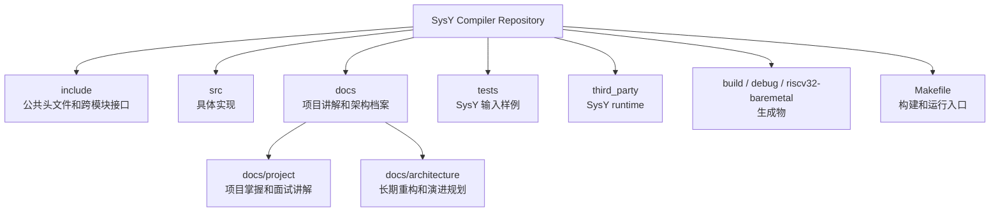
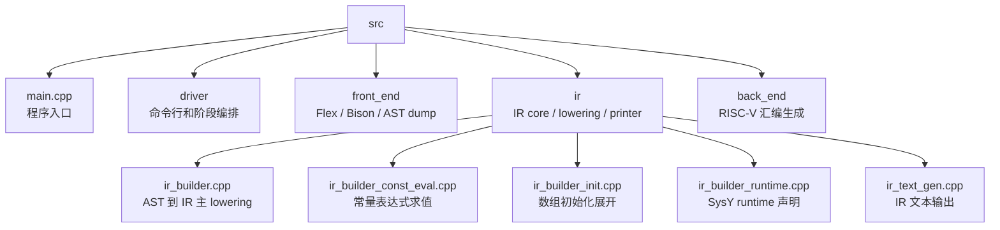
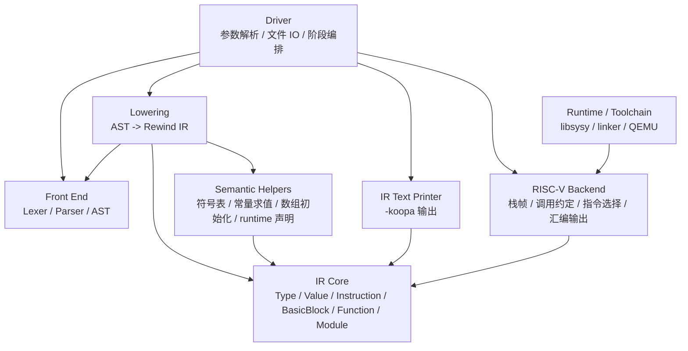
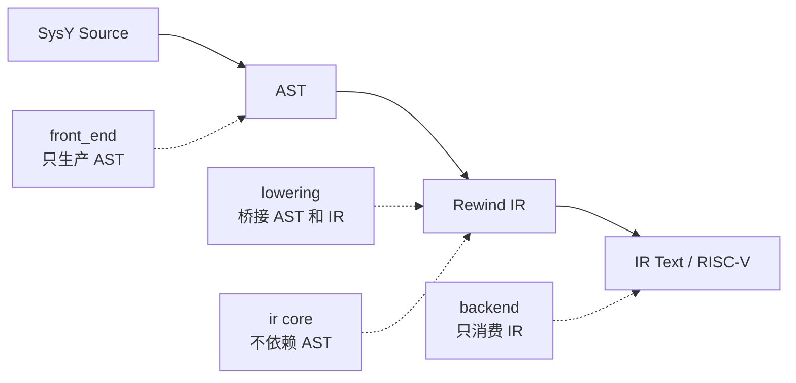

# Project Structure

这份文档合并原来的项目组织和模块架构说明，从“目录结构”和“逻辑模块”两个角度描述当前项目。

## 仓库目录组织

## 源码目录组织

## 逻辑模块关系

## 依赖方向

关键原则：

- `front_end` 不依赖 IR，只负责把源码变成 AST。
- `IR core` 不依赖 AST，只负责表达中间表示。
- `lowering` 是唯一同时理解 AST 和 IR 的桥接层。
- `backend` 只依赖稳定 IR，不直接依赖 parser 或 AST。
- `driver` 不承担具体编译逻辑，只负责阶段编排。

> 项目目录上按接口、实现、文档、runtime 和生成物分层；逻辑上按 driver、front end、lowering、IR core、IR printer、RISC-V backend 分层。核心设计是让 AST 和 IR 解耦，让 lowering 成为唯一桥接层，后端只消费稳定 IR。
